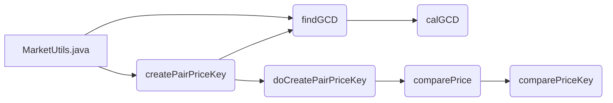

## Module: MarketUtils.java
模块：MarketUtils.java

主要目标：该模块的主要目的是创建市场价格相关的功能。

关键功能：主要方法和函数以及其作用包括：
- createPairPriceKey：创建价格键，通过计算卖出和买入代币数量的最大公约数来避免哈希映射和LevelDB之间存储和提取数据的差异。
- findGCD：计算两个数的最大公约数。
- doCreatePairPriceKey：执行创建价格键的操作。
- comparePriceKey：比较价格键的大小。
- comparePrice：比较价格的大小。

关键变量：重要变量包括TOKEN_ID_LENGTH、sellTokenId、buyTokenId、sellTokenQuantity和buyTokenQuantity。

相互依赖性：该模块与其他系统组件的交互主要体现在价格键的创建和比较操作中。

核心与辅助操作：主要操作包括创建价格键和比较价格，辅助操作包括计算最大公约数等。

操作序列：操作序列包括创建价格键、计算最大公约数、比较价格键和价格等步骤。

性能方面：在性能方面，模块考虑了使用BigInteger来处理大整数计算以提高性能。

可重用性：该模块具有较高的可重用性，可以在其他项目中轻松适应并重复使用。

用法：该模块主要用于创建和比较市场价格相关的操作。

假设：模块假设参数为同一代币对，并且所有数量均大于0。
## Flow Diagram [via mermaid]

